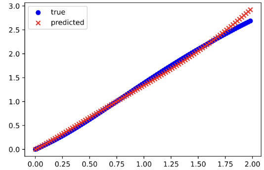

# SGD-based approach to neurosymbolic computations

This is a repository of a project done as a part of *Program Synthesis* course in the program of *Artificial
Intelligence* master's studies at Poznan University of Technology.

## Scope of the project

We propose an approach to neurosymbolic computations that can be briefly described as follows:

```
Generate maximal possible function
As long as the function is not sound with the specification:
    Use Stochastic Gradient Descent to find coefficient of the function
    Delete the block with the smallest coefficient
```

## Program specification

Using `ModelFactory` and `MultiLayerFactory` (file: `model`) a user can define the following constraints:

- `max_size` [int] - maximum number of blocks in a layer,
- `layers` [int] - maximum size of functions composition (model depth),
- `min_significance` [float] - minimum coefficient value allowable in the final model,
- and many others with descriptive names that can be observed constructors signatures, in the file `model`.

After giving model specification, user can create a model by defining the grammar using blocks from file `blocks` and
one of the functions:

- `ModelFactory().from_class_list()`
- `ModeFactory().from_occurrence_dict()`

Minimal example for linear combination of blocks:

```
from blocks import BiasBlock, LinearBlock, Pow2Block, SinBlock
from model import ModelFactory

f = ModelFactory(x, y, max_size=5, min_significance=0.5).from_occurrence_dict({LinearBlock: 1, BiasBlock: 1, SinBlock: 5, Pow2Block: 3})
```

Minimal example for multilayer model:

```
from blocks import BiasBlock, LinearBlock, Pow2Block, Pow3Block, SqrtBlock, CubeRootBlock
from model import ModelFactory

f = ModelFactory(x, y, max_size=3, layers=2).from_class_list([BiasBlock, LinearBlock, Pow2Block, Pow3Block, SqrtBlock, CubeRootBlock])
```

## Results on common benchmarks

<table>
    <tr>
        <td><strong>Nguyen-6</strong></td>
        <td> </td>
        <td> </td>
    </tr>    
    <tr>
        <td><strong>Sine</strong></td>
        <td> </td>
        <td> </td>
    </tr>
    <tr>
        <td><strong>Nguyen-7</strong></td>
        <td> </td>
        <td> </td>
    </tr>
    <tr>
        <td><strong>Keijzer-3</strong></td>
        <td> </td>
        <td> </td>
    </tr>
</table>